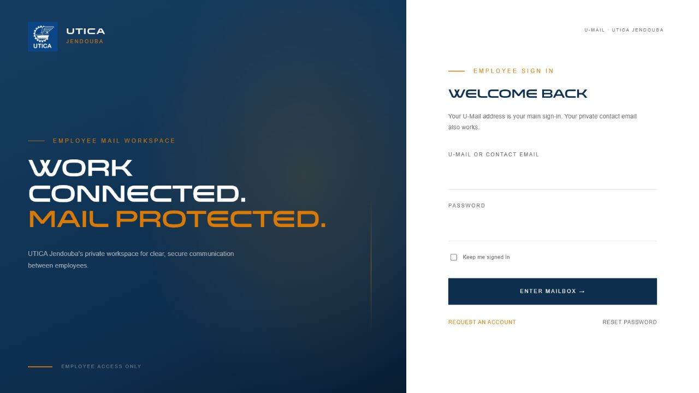
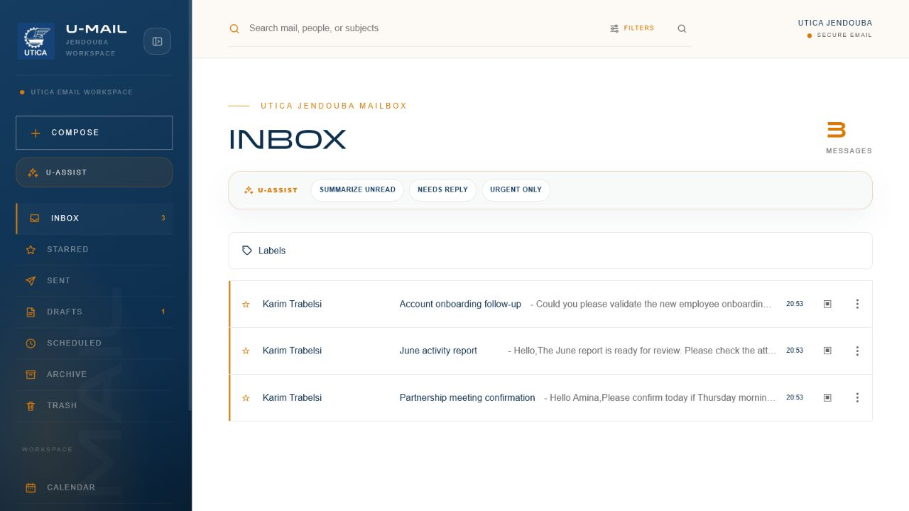
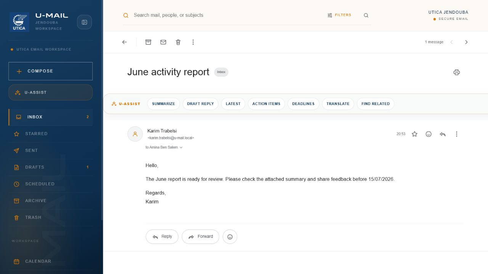
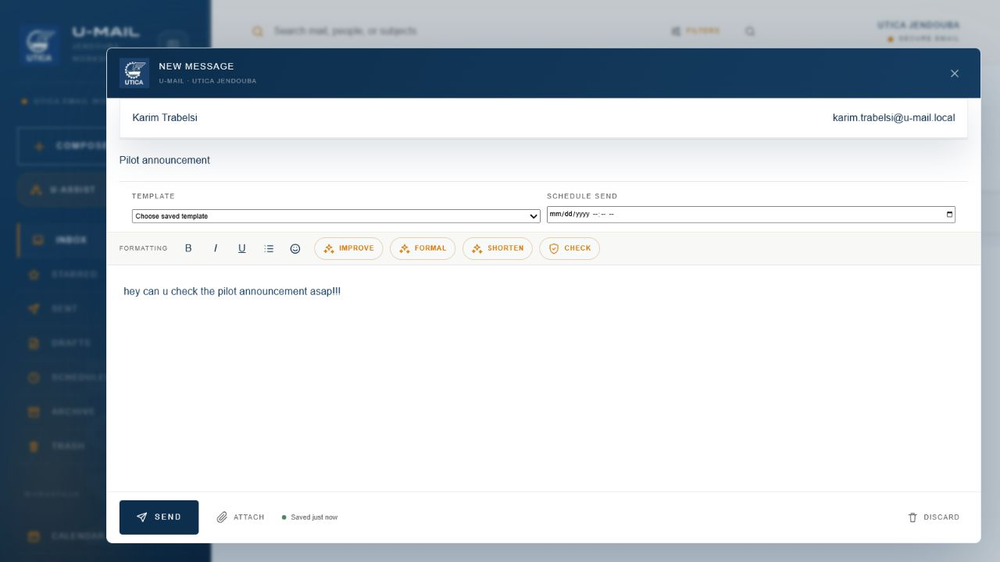

# U-Mail


**U-Mail** is a standalone, Gmail-inspired mailbox workspace built for UTICA Jendouba employees. It provides private internal mail, external email delivery through a configured SMTP gateway, admin-approved employee onboarding, MFA, audit logging, desktop notifications, and a local Llama 3.2-powered mailbox assistant.

The interface uses UTICA branding with locally bundled Poppins/Venera font assets. It does not depend on remote stylesheets, remote fonts, or third-party UI assets at runtime.

## Screenshots

| Employee Login | Inbox Workspace |
| --- | --- |
|  |  |

| Gmail-Style Reader | Compose With U-Assist |
| --- | --- |
|  |  |

## Highlights

- Gmail-style mailbox with Inbox, Sent, Drafts, Starred, Archive, Trash, search, threads, replies, forwarding, Cc, Bcc, and private attachments
- Employee account requests with contact-email confirmation, administrator approval, generated U-Mail address, and emailed temporary password
- Optional authenticator-app MFA, email-code MFA, recovery codes, password confirmation, session revocation, and security-event auditing
- Owner-only credential registry, masked by default and audited on reveal
- U-Assist local Llama 3.2 mailbox agent for authorized search, thread summaries, formal draft preparation, pre-send checks, deadlines, and action plans
- Same-Wi-Fi HTTPS pilot tooling for coworker testing through `https://u-mail.test`
- Strict mail privacy: administrators cannot inspect employee mail unless they are recipients

## Included

- Public employee account requests with contact-email confirmation, administrator approval, and privately emailed U-Mail credentials
- Self-service password-reset codes for employees and administrators
- Inbox, Sent, Drafts, Starred, Archive, Trash, search, threaded replies, forwarding, Cc, and private Bcc
- Rich-text composition, five-second draft autosave, private attachments, and 15-second unread polling
- Optional local desktop notifications for new inbox mail while a signed-in U-Mail tab is open
- U-Assist local Llama 3.2 mailbox agent for authorized search, thread summaries, reply drafts, pre-send reviews, and reviewed action plans
- Independent read, starred, archived, and trashed state for every employee
- Admin-only `all-employees` recipient
- Send and receive email with both U-Mail users and any valid internet email address
- Generated U-Mail addresses as the primary sending and receiving identity
- Queued internet delivery with user-friendly sending, delivered, and failed states
- Optional authenticator-app and email-code MFA for every active account
- Self-service password changes that revoke other sessions and update the owner credential registry
- Click-to-open account menu with editable names, phone numbers, and privately stored profile photos
- Five-minute password confirmation for sensitive administrator and owner operations
- Immutable security-event auditing with 180-day retention
- Daily purge of mailbox copies left in Trash for more than 30 days
- Admins cannot inspect employee mail unless they are recipients

## Requirements

- PHP 8.4.1 or newer with `pdo_mysql`, `mbstring`, `openssl`, `fileinfo`, and `dom`
- MySQL 8+ or compatible MariaDB
- Node.js 22+ and npm
- A web server pointing to `public/`

## Production Setup

```powershell
Copy-Item .env.example .env
composer install --no-dev --optimize-autoloader
php artisan key:generate
npm install
npm run build
php artisan migrate --force
php artisan utica:create-admin admin@utica.example --name="UTICA Administrator"
php artisan optimize
```

Set the MySQL credentials and production URL in `.env` before migrating. Attachments are stored privately under `storage/app/private`; back up both MySQL and that directory.

Run the scheduler every minute:

```text
* * * * * cd /path/to/utica-mail-v2 && php artisan schedule:run
```

Use a long-running queue worker if queued work is added later:

```powershell
php artisan queue:work
```

## Employee Registration

1. A requester opens `/register` and enters their name, contact email, and optional phone number.
2. U-Mail emails a six-digit confirmation code to the contact email.
3. After the contact email is confirmed, U-Mail generates a unique address using `firstname.lastname@PUBLIC_MAIL_DOMAIN` and places the request in the administrator dashboard.
4. Approval activates the account and emails the generated U-Mail address and a strong temporary password to the verified contact email.
5. Employees send and receive mail using their generated U-Mail address. Their private contact email is used only for account messages and may also be used to sign in.
6. Employees and administrators request password-reset codes from `/reset-password`.

For local development, use the included Mailpit catcher:

```powershell
docker compose -f compose.mailpit.yaml up -d
```

Contact-confirmation, approval, activation, and reset emails are delivered locally to `http://127.0.0.1:8025`. The default `.env` sends to `127.0.0.1:1025`; Mailpit captures every recipient without contacting the internet.

Messages addressed to people without U-Mail accounts are sent through the configured SMTP service. Mailpit captures those external messages during local development.

Every account receives a unique local public address under `u-mail.local`. Messages addressed to an active public address are delivered directly into that employee's U-Mail inbox without administrator approval. Unknown and inactive addresses go to the owner inbox.

The local start script also runs the database queue worker and Laravel scheduler. Outside delivery happens in the background, so internal U-Mail delivery is not blocked by the external mail service.

For real internet delivery, replace the Mailpit values in the production `.env` with credentials from an SMTP provider and use a verified sender address:

```dotenv
MAIL_MAILER=smtp
MAIL_SCHEME=tls
MAIL_HOST=smtp.your-provider.example
MAIL_PORT=587
MAIL_USERNAME=your-smtp-username
MAIL_PASSWORD=your-smtp-password
MAIL_FROM_ADDRESS=no-reply@your-verified-domain.example
MAIL_FROM_NAME="${APP_NAME}"
```

Set `OWNER_EMAIL` to the email address of an active administrator. That account alone can open `/owner/credentials`, which lists every account and its latest known password. Authentication passwords remain one-way hashed; the owner registry stores a separate encrypted-at-rest copy that is synchronized during activation, password reset, and `utica:create-admin`. Protect the application key and owner account carefully because access to either can expose these credentials.

## Production Security

- Serve U-Mail only through HTTPS and set `APP_DEBUG=false`.
- Set `SESSION_SECURE_COOKIE=true`, `SESSION_ENCRYPT=true`, and `SESSION_SAME_SITE=strict`.
- Configure `TURNSTILE_ENABLED=true` with Cloudflare Turnstile site and secret keys.
- Administrators are automatically signed out after 15 idle minutes and cannot use persistent sign-in.
- Users may enable authenticator-app MFA, email-code MFA, or both from **Security**.
- Password-reset codes expire after 15 minutes; activation codes remain valid for 24 hours.
- Owner credential reveals are masked by default, require recent password confirmation, and are audited.

## Local Development And Tests

The checked-in `.env.example` targets MySQL. Automated tests use isolated in-memory SQLite.

### Same-Wi-Fi Coworker Pilot

The coworker pilot exposes only local HTTPS through Caddy. Laravel remains on
`127.0.0.1:8090`, and Mailpit remains private on `127.0.0.1:8025` and
`127.0.0.1:1025`.

Install Caddy once:

```powershell
winget install --id CaddyServer.Caddy --exact
```

Prepare the host, firewall, local certificate, backup, and coworker package:

```powershell
cd C:\utica-mail-v2
.\prepare-lan-pilot.ps1
```

The host machine also starts local Ollama, enables the U-Assist local agent
through `http://127.0.0.1:11434`, warms the `llama3.2:latest` model, and makes
U-Assist available for active coworker accounts. Ollama stays host-only;
coworkers do not install Ollama and do not connect to port `11434` directly.

The script creates the coworker package in
`storage\app\coworker-setup`. Keep that folder together and give it only to
pilot participants. Send `storage\app\coworker-setup.zip`; each coworker
extracts the complete ZIP, connects to Wi-Fi `TT_1B88`, double-clicks
`Install U-Mail Access.cmd`, accepts the administrator prompt, and opens
`https://u-mail.test/register`. Double-click `Remove U-Mail Access.cmd` after
the pilot. If installation fails, `Check U-Mail Connection.cmd` reports
whether the coworker computer can reach the host laptop.

Because the host Wi-Fi address is assigned through DHCP, rerun
`prepare-lan-pilot.ps1` and redistribute the package whenever the address
changes.

Verify the running pilot at any time:

```powershell
.\verify-lan-pilot.ps1
```

Create a manual SQLite and private-attachment backup:

```powershell
.\backup-u-mail.ps1 -Label before-demo
```

Account requests are enabled for the same-Wi-Fi pilot. Until real SMTP is
configured, contact-confirmation and approved-account emails are captured in
private Mailpit on the host laptop at `http://127.0.0.1:8025`. Do not expose
Mailpit to coworkers; the project owner can read the confirmation code and
give it to the requester during the pilot.

For real delivery to coworker inboxes, request the SMTP hostname, port,
encryption method, username, password, approved sender address, and any
sender-domain verification or IP allowlisting requirements from UTICA or
MajestEye. After adding those values to `.env`, restart U-Mail and test
registration with the owner's external email before inviting coworkers.

### Daily Local Start

From PowerShell:

```powershell
cd C:\utica-mail-v2
.\start-u-mail.ps1
```

The script starts Docker Desktop when needed, private Mailpit, U-Mail on its
loopback port, the worker, scheduler, the Caddy HTTPS gateway, and the local
Ollama-backed U-Assist agent for signed-in users. To re-enable U-Assist for
every active account while starting the host, run `.\start-u-mail.ps1 -EnableAgentForAllUsers`.

- Employee login: `https://u-mail.test/login`
- Administrator login: `https://u-mail.test/utica-admin-entry` by default, or the value of `ADMIN_LOGIN_PATH`
- Local activation/reset emails: `http://127.0.0.1:8025`

Stop the local services with:

```powershell
cd C:\utica-mail-v2
.\stop-u-mail.ps1
```

```powershell
composer install
npm install
php artisan migrate
php artisan test
npm run build
```

Run V2 on its dedicated local address so it cannot be confused with the original project:

```powershell
php artisan serve --host=127.0.0.1 --port=8090
```

Then open `http://127.0.0.1:8090/login`.

- Employees sign in at `http://127.0.0.1:8090/login`.
- Administrators sign in at the configured hidden admin path, `http://127.0.0.1:8090/utica-admin-entry` by default.
- Each portal only accepts its intended role. Employee sessions cannot access administrator routes or controls.

On this Windows workstation, use Herd PHP 8.4 because the default XAMPP PHP is too old:

```powershell
& 'C:\Users\ammou\.config\herd\bin\php84\php.exe' artisan test
```

## Security Notes

- Only active, registered users can receive mail or authenticate.
- Every thread, mailbox action, and attachment download is authorized against the current user's mailbox entries.
- Rich text is sanitized and executable/script attachment formats are rejected.
- The application enforces privacy, but database/server operators can still access stored content.

## Scope

This first release intentionally excludes live inbound external IMAP synchronization, custom labels, filters, signatures, vacation replies, chat, and calendar features.
